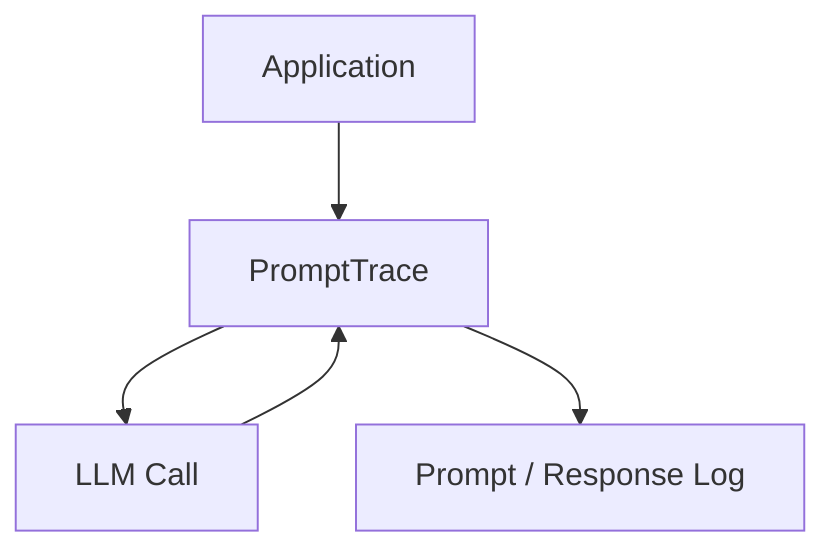

# PromptTrace
================

[](LICENSE)
[](https://www.python.org/)
[](README.md#roadmap)

## Overview
-----------

PromptTrace is a lightweight debugging tool designed to record and analyze prompts and responses in Large Language Model (LLM) workflows. This tool enables developers to inspect prompt history and understand how model interactions evolve over time.

## Quick Start
--------------

To get started with PromptTrace, follow these steps:

### Clone the Repository

```bash
git clone https://github.com/joshuamlamerton/prompttrace
```

### Navigate to the Project Directory

```bash
cd prompttrace
```

### Run the Demo

```bash
python examples/demo.py
```

This demo showcases the basic functionality of PromptTrace, including prompt recording, response logging, and trace history storage.

## Architecture
--------------

The following diagram illustrates the high-level architecture of PromptTrace:



## Features
------------

The demo illustrates the following key features of PromptTrace:

*   **Prompt Recording**: Records user input prompts.
*   **Response Logging**: Stores model responses to user prompts.
*   **Trace History**: Stores a record of all prompts and responses, enabling developers to inspect and analyze the interaction history.

## Repository Structure
-------------------------

The PromptTrace repository is organized as follows:

```text
prompttrace

README.md
LICENSE

docs
  architecture.md

core
  trace.py

examples
  demo.py
```

## Roadmap
------------

The development roadmap for PromptTrace is divided into four phases:

### Phase 1: Prompt-Response Logging

*   Implement basic prompt-response logging functionality.

### Phase 2: Trace Filtering

*   Introduce filtering capabilities to enable developers to analyze specific interactions.

### Phase 3: Session Replay

*   Develop a session replay feature to allow developers to re-examine interaction history.

### Phase 4: Dashboard Visualization

*   Create a user-friendly dashboard to visualize interaction data and facilitate debugging.

Note: The current status of the project is marked as experimental, and the roadmap is subject to change based on community feedback and development progress.