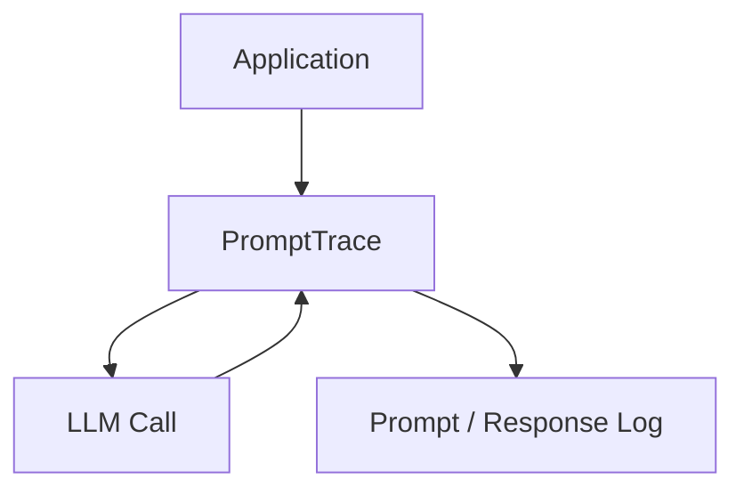

# PromptTrace


PromptTrace is a lightweight debugging tool for recording prompts and responses in LLM workflows.

It helps developers inspect prompt history and trace how model interactions evolve over time.

## Quick Start

Clone the repository and run the demo.

```bash
git clone https://github.com/joshuamlamerton/prompttrace
cd prompttrace
python examples/demo.py
```

## Architecture



## What it does

The demo shows:

- a prompt being recorded
- a response being recorded
- a trace history being stored

## Repository Structure

```text
prompttrace

README.md
LICENSE

docs
  architecture.md

core
  trace.py

examples
  demo.py
```

## Roadmap

Phase 1  
Prompt-response logging

Phase 2  
Trace filtering

Phase 3  
Session replay

Phase 4  
Dashboard visualization
